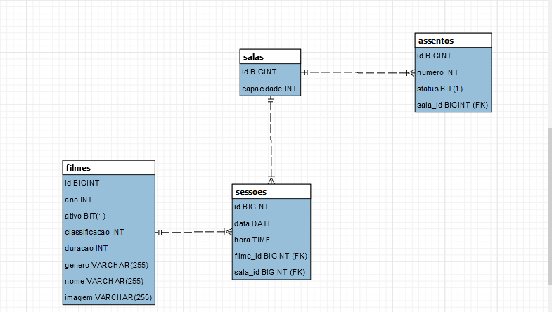
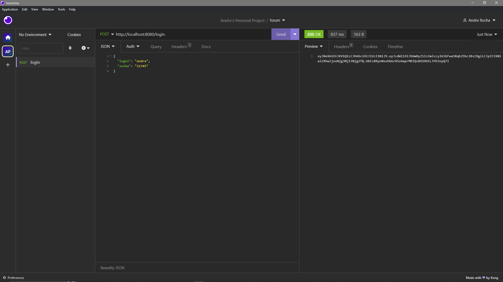
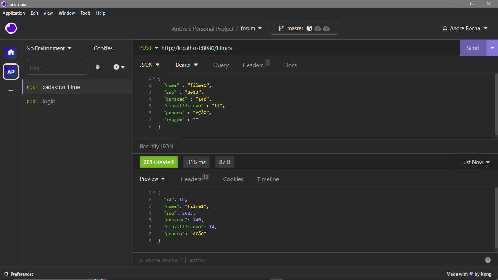
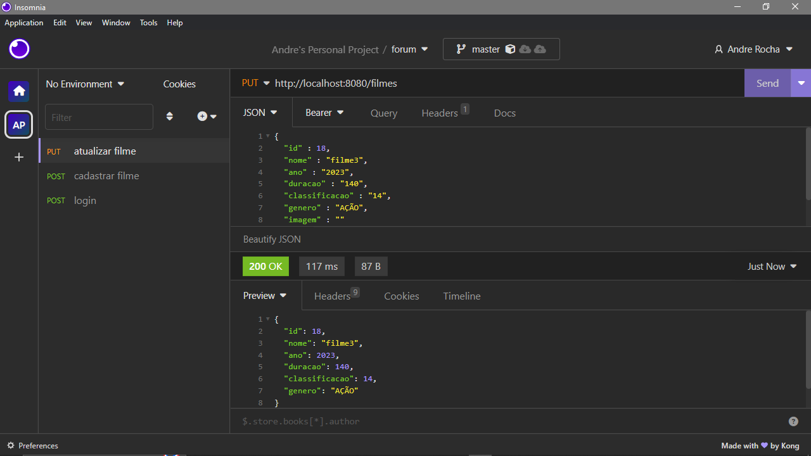
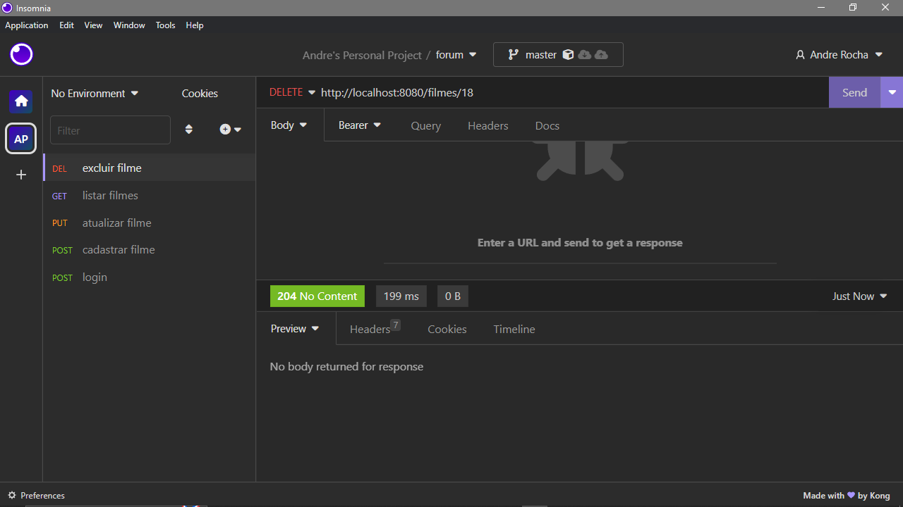
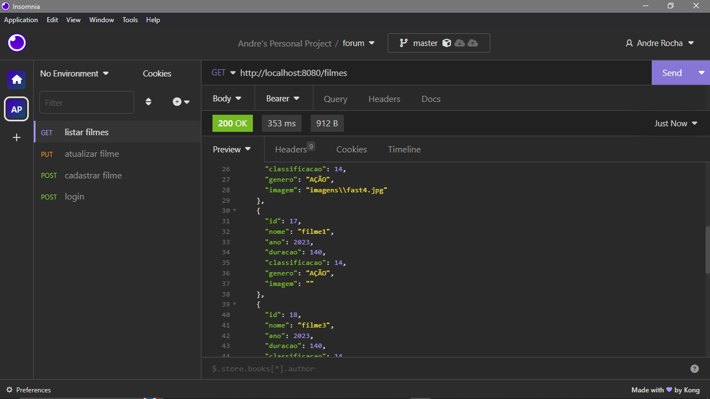
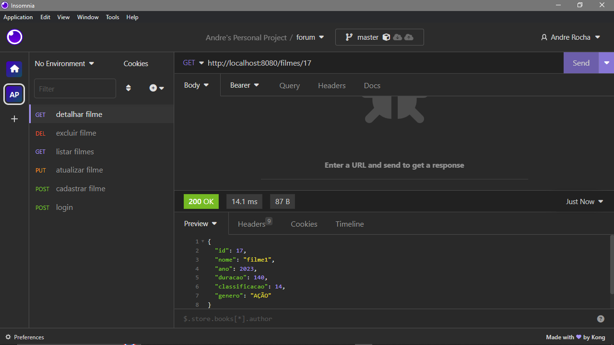

<h1 align="center">API jonaxPlex</h3>

---

API para gerenciamento de um cinema
      

## 📝 Menu

- [Sobre](#sobre)
- [Importante](#importante)
- [Banco de dados](#bd)
- [Screenshots](#screenshots)
- [Tecnologias](#tecnologias)
- [Autor](#autor)

## 🧐 Sobre 

O sistema de gerenciamento possui as funcionalidades de cadastrar, editar e excluir dados de filmes, sessões, sala, clientes de um cinema.

## ⚠️ Importante! 

☕ Use o Java na versão 17 ou superior para ter compatibilidade. 
  

## 📊 Banco de Dados 
<h1 align="center">
  
</h1>

## 📸 Screenshots 
<h1 align="center">
  
</h1>
<h1 align="center">
  
</h1>
<h1 align="center">
  
</h1>
<h1 align="center">
  
</h1>
<h1 align="center">
  
</h1>
<h1 align="center">
  
</h1>

## ⛏️ Tecnologias 

- [Java 17](https://www.oracle.com/br/java/)
- [Spring boot](https://spring.io/projects/spring-boot)
- [Maven](https://maven.apache.org/)
- [Lombok](https://projectlombok.org/)
- [Mysql](https://www.mysql.com/)
- [Hibernate](https://hibernate.org/)
- [Intellij](https://www.jetbrains.com/pt-br/idea/)

## ✍️ Autor 

- [@Andrejmrocha](https://github.com/Andrejmrocha) - Desenvolvimento back-end

